# Workshop 2: 
# Start Building Machine Learning Models Faster than You Think

## Workshop Abstract

Tailwind Traders uses custom machine learning models to fix their inventory issues – without changing their Software Development Life Cycle! How? Azure Machine Learning Designer.
 
In this workshop, you’ll learn the data science process that Tailwind Traders’ uses and get an introduction to [Azure Machine Learning Designer](https://docs.microsoft.com/en-us/azure/machine-learning/service/concept-designer). You’ll see how to find, import, and prepare data, select a machine learning algorithm, train and test a model, and deploy that complete model to an API. Get the tips, best practices, and resources you need to continue your machine learning journey, build your first model, and more.

## Pre-reading

* **Azure Basics**
    * I would recommend getting a basic understanding of cloud technologies and Azure (storage, VMs and networking) from [Azure Fundamentals](https://docs.microsoft.com/en-us/learn/paths/azure-fundamentals/?WT.mc_id=aimlworkshop-github-amynic) 

## Pre-requisites

* Laptop with a modern web browser (Edge, Chrome etc)
* Access to a [Azure Subscription](https://azure.microsoft.com/en-us/free/students/?WT.mc_id=aimlworkshop-github-amynic)
* [Visual Studio Code](https://code.visualstudio.com/?WT.mc_id=aimlworkshop-github-amynic)
* Basic understanding of how to access code and instructions from [GitHub](https://guides.github.com/)

## Deploy the Workshop Environment:

Select the **Deploy to Azure button** above to create the environment needed for this workshop.

* Click the 'Deploy to Azure' button
* Log into Azure
* Select your subscription
* Create a new resource group and name it aiml-workshop2
* Select your nearest location, e.g. WestEurope
* Create an Azure Machine Learning workshop name, e.g. aiml-workshop2
* Select your nearest location (make sure its the same as the resource group location for best practice)
* Select the checkbox to agree to the terms and conditions
* Click Purchase

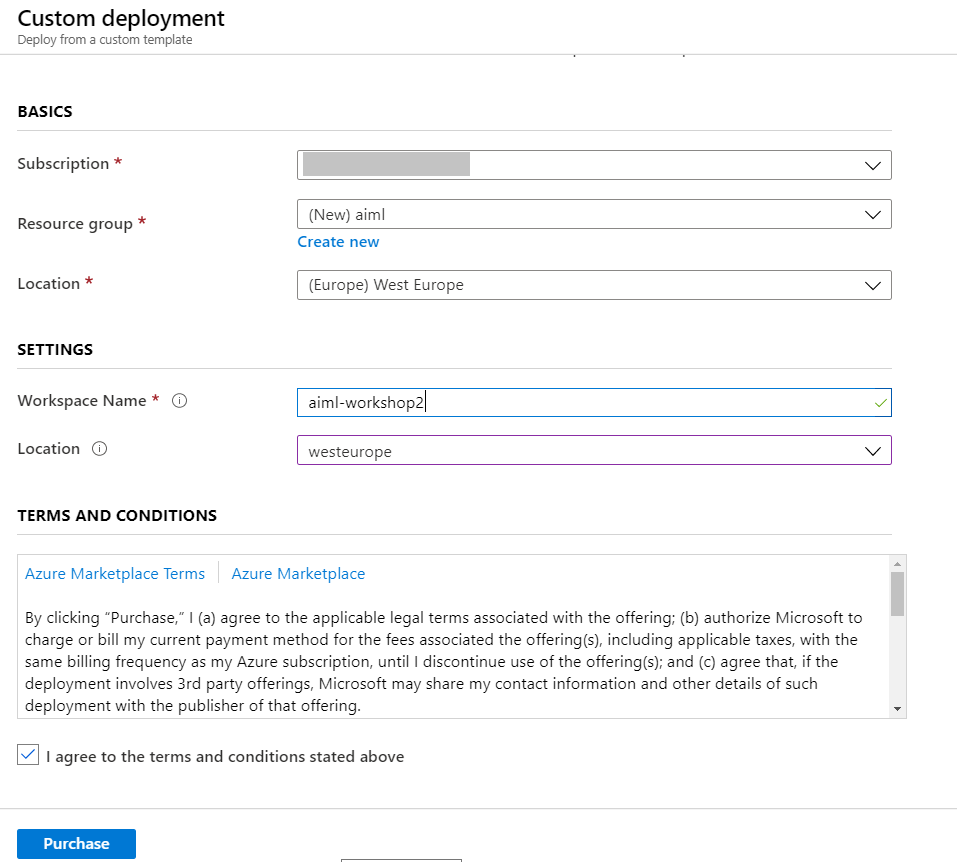

Once complete
* Browse to the Azure Resource group and select the Azure Machine Learning service icon
* Select the Upgrade button at the top of the screen to upgrade to enterprise edition
* Then launch the Azure Machine Learning Studio

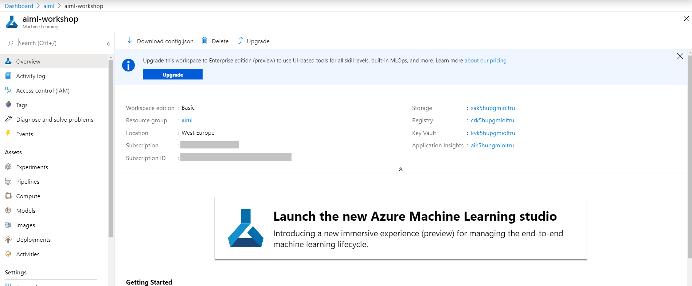

## Create Additional Resources Needed
Once you have created the base Azure Machine Learning Service and entered the Studio window (http://ml.azure.com) we need to add additional compute resources.

### Create Compute Instance
1. Create Compute Instance (Notebook VM)
    * Click on the nav "Compute"
    * Click "New"
    * Enter a name for your compute instance
    * Click Create

2. Create Training Cluster
    * Click on the nav "Compute"
    * Select 'Training Clusters'
    * Click "New"
    * Enter a name for the resource
    * Select the machine size, e.g. Standard_D2_v2
    * Select Low Priority
    * Enter the min and max nodes (recommend min of 0 and max of 5)
    * Click "Create"
    

3. Create Inference Cluster
    * Click on the nav "Compute"
    * Select "Inference Clusters"
    * Click "New"
    * Enter a name for the resource
    * Under Kubernetes Service - select "Create New"
    * Select the same region as your other resources
    * Keep standard size machine
    * Select Dev-test
    * Click "Create"
    

## Build Model with Azure Machine Learning Visual Designer

### 1. Upload the dataset to the Datasets in AML
* Download dataset to local from [here](https://globaleventcdn.blob.core.windows.net/assets/aiml/aiml30/datasets/ForecastingData.csv)
* Click `Datasets` in Azure Machine Learning Studio
* Click `Create dataset` and 'From local files'
* Provide and name for the dataset (e.g. ForecastingData) and choose Tabular as format - click Next
* Browse for the dataset downloaded - click Next
* Fill out the form and upload the dataset. For 'Column headers' select 'Use headers from the first file' - click Next
* Click Next on the Schema page
* On the confirmation page there is a small checkbox "Profile this dataset after creation" select this and choose the training compute name you created above from the drop down box called 'Select compute for profiling'
* Finally click Create

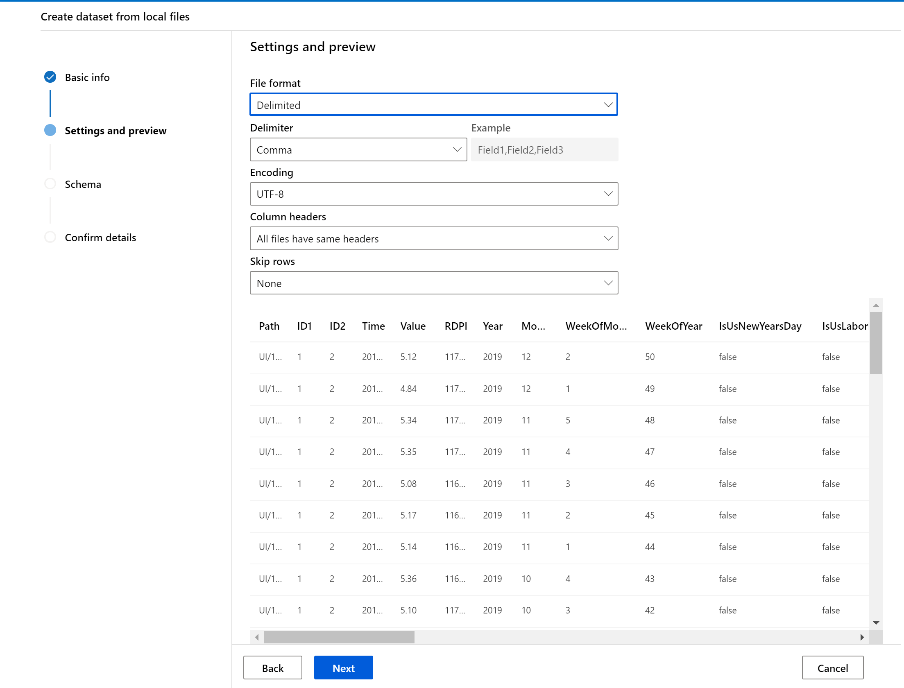

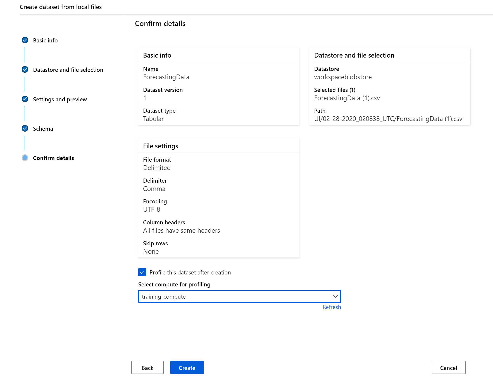

### 2. Data Preparation Stages

> Note: If your Compute Instance has not finished creating please move onto the next task ['3. Start Building the Model'](#3.-start-building-the-model) and revisit this task when the compute has created. 

> Note: If you wish to use Jupyter instead of Jupyter lab, follow the instructions here. [using-jupyter-for-dataprep.ipynb](using-jupyter-for-dataprep.md)

1. Navigate to your 'Compute instances' in the Compute tab
2. Select the `Jupyter Lab` option. (This will not display until the VM is in a `running` state.)
3. Click the terminal from the home page of Jupyter Lab

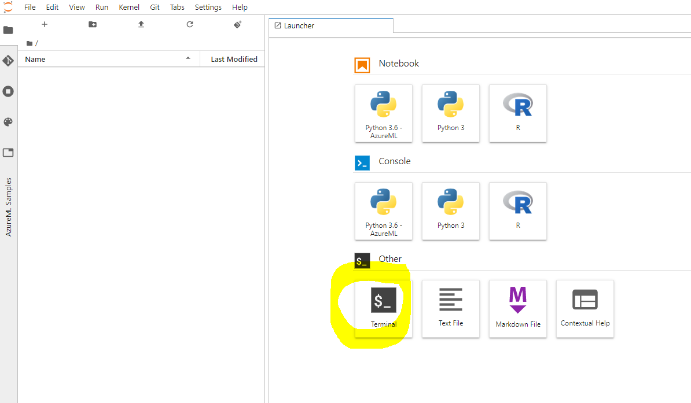

4. Clone the repo from the terminal in Jupyter Lab
    * `git clone https://github.com/microsoft/ignite-learning-paths-training-aiml.git`
5. Also in the terminal `pip install holidays`
6. Open the `ignite-learning-paths-training-aiml` cloned folder and navigate to the `ignite-ailml30-get-prediction.ipynb` file and click to open it.
    * The full path should be something like this: `ignite-learning-paths-training-aiml\aiml30\Python\ignite-ailml30-get-prediction.ipynb`
7. Upload the dataset you downloaded from the repository 'ForecastingData.csv' into the jupyter lab environment
8. Update the path to the csv file
9. Run and review all data processing cells until you reach 'Create function to get prediction from API' - we will revisit this notebook again later in the workshop

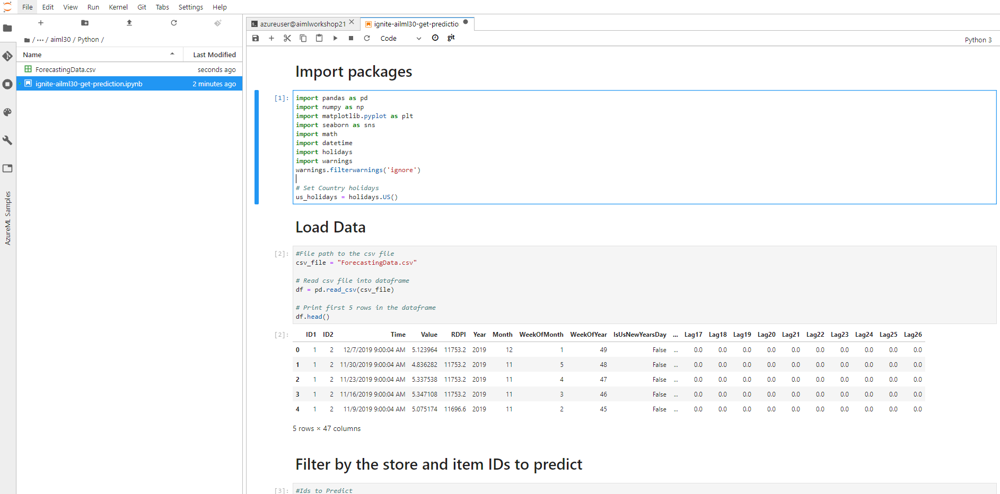

### 3. Start Building the  Model

Now we have enriched and preprocessed our forecasting dataset we can start to build our forecasting model. Azure Machine Learning designer is a grad and drop interface where you can quickly build and expeirment with machine learning models.

Go back to the Home page in the Azure Machine Learning studio (http://ml.azure.com/)

* Click `Designer` from the left nav
* Click plus sign to create a new experiment

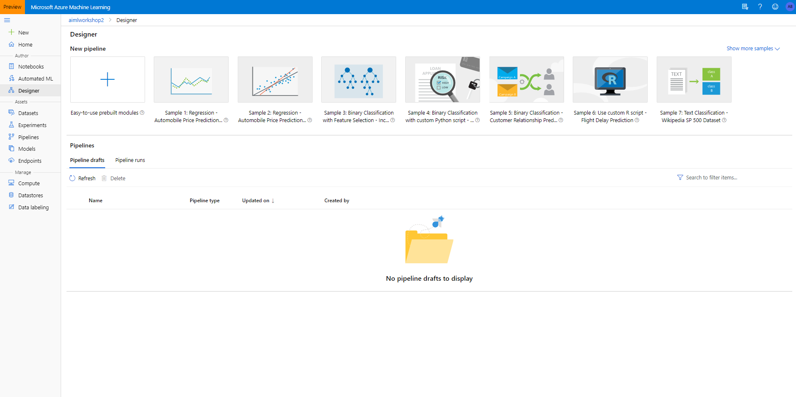

* On the `Settings` tab, `Select compute target` and choose the training compute you created
* Also in the `Settings` tab edit the experiment name and description

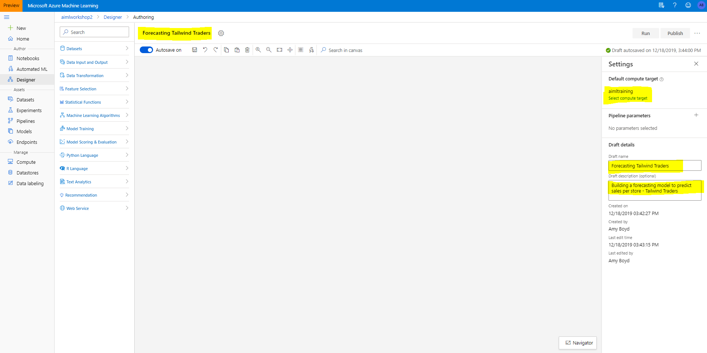

* Expand `Datasets` and `My Datasets`
* Drag and drop the uploaded dataset onto the experiment workspace

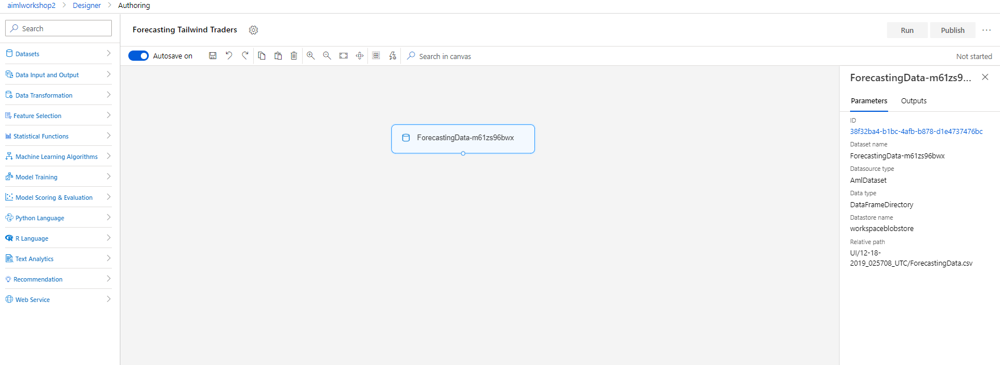

* Drag the `Select Columns in Dataset` onto the workspace (In the `Data Transformation` Category)
    * Connect the output of the dataset to the input circle of the `Select Columns in Dataset` module

There are two ways to complete this task:

1)

    * Click `Edit columns` from the parameters menu on the right side.
    * Click `By Name`
    * Click `Add All`
    * Click `Minus` icon on the `Time` column to exclude it

2) 

    * Click 'With rules'
    * Click 'Include' and 'All Columns'
    * Click +
    * Click 'Exclude' and 'Column Names' and type 'Time'

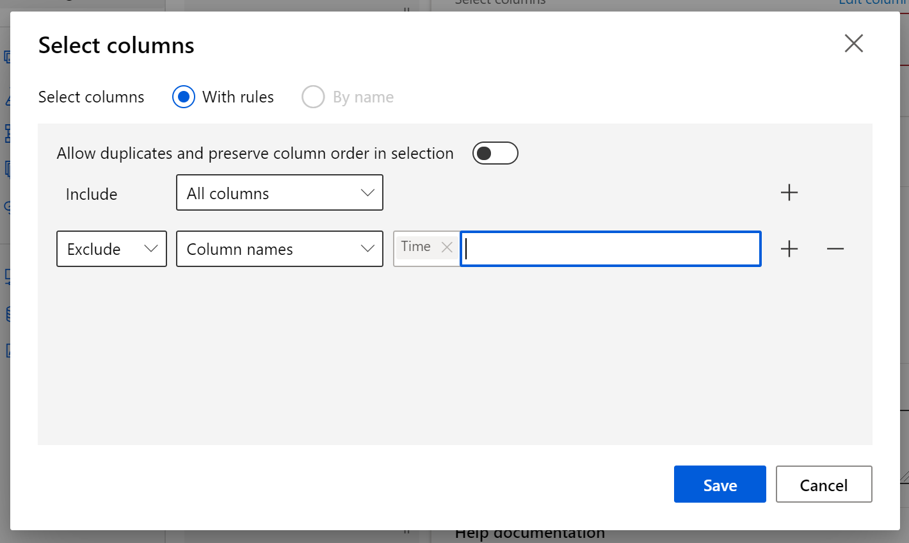

* Drag the `Split Data` onto the workspace
    * Edit the parameters to split the data 70/30 by setting the `Fraction of rows in the first output dataset` to 0.7
    * This is not a rule and can change base on different model needs.
* Drag the `Train Model` onto the workspace
    * Connect the 1st output port of the `Split Data` module to the 2nd input port of the `Train Model` module
    * Select Edit columns and type `Value` and enter as the target column to train on
* Drag the `Boosted Decision Tree Regression` onto the workspace
* Drag the `Score Model` onto the workspace
* Drag the `Evaluate` onto the workspace
* Connect:
    * `Boosted Decision Tree` -> 1st port `Train Model`
    * `Train Model` output -> 1st port `Score Model`
    * `Split Data` 2nd port -> `Score Model` 2nd port
    * `Score Model` -> `Evaluate Model`

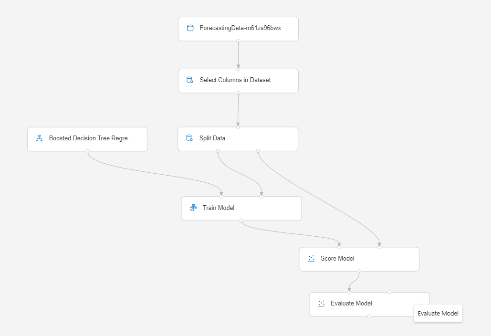

* Click the `Submit` button at the top right of the screen
* Select `Experiment`, click `Create new`, enter experiment name 
* Select `Submit`

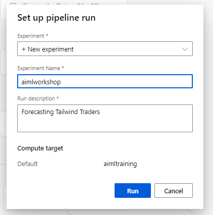

*This will take around 15 - 20 mins to run ...*

> NOTE: If you have not completed Task 2 using Jupyter Lab on your Compute Instance - go back now whilst the experiment is running and complete

Once you see all modules with green ticks next to them:

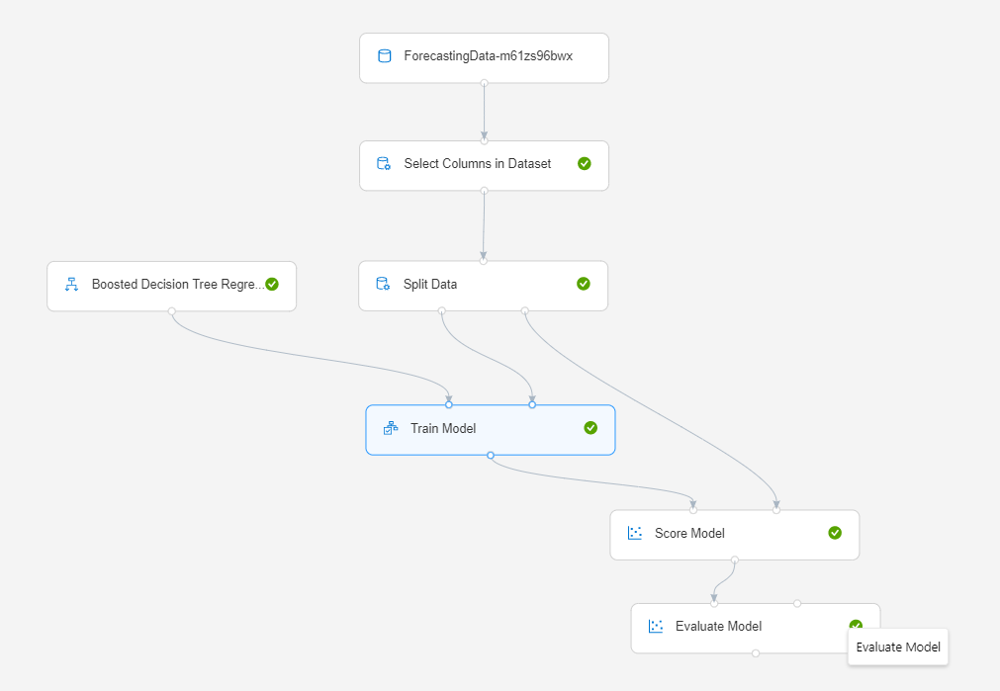

* Rename the created column `Scored Labels` to `Forecast`
    * Drag the `Edit Metadata` onto the workspace
    * Connect `Score Model` with the `Edit Metadata` module
    * In the `Parameters` of the `Edit Metadata` module. Click `Edit Columns`
    * Type `Scored Labels` into the text box (no need to change any of the defaults)
    * Click `Save`
    * Next update the `New Column Name` field on the `Parameters` to `Forecast`
* Transform the normalized values back to full item counts
    * Drag the `Apply Math Operation` onto the workspace
    * Connect `Edit Metadata` to `Apply Math Operation`
    * Set the `Basic math function` to `Exp`
    * Click `Edit Columns` and type `Value` and `Forecast`
    * Click `Save`
    * Set the `Output mode` to `Inplace`
* Drag the `Select Columns in Dataset` module onto the workspace
* Connect the `Apply Math Operation` to `Select Columns in Dataset`
* Click `Edit Columns` and type the following column names `ID1,ID2,Value,Forecast`
* These are the columns the data demo app will be expecting when we post to get a result from the completed and deployed model.
* Run the training

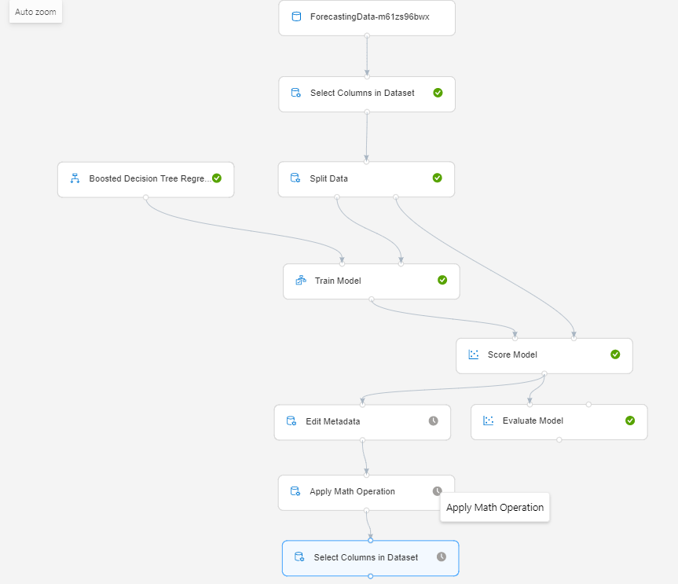

### 4. Create Inference Pipeline and Deploy the Model
* Click `Create inference pipeline` then select `Real-time inference pipeline`
* Ensure the `Web Service Output` is connected to the last data processing step module `Select Columns in Dataset`
* Click `Run`

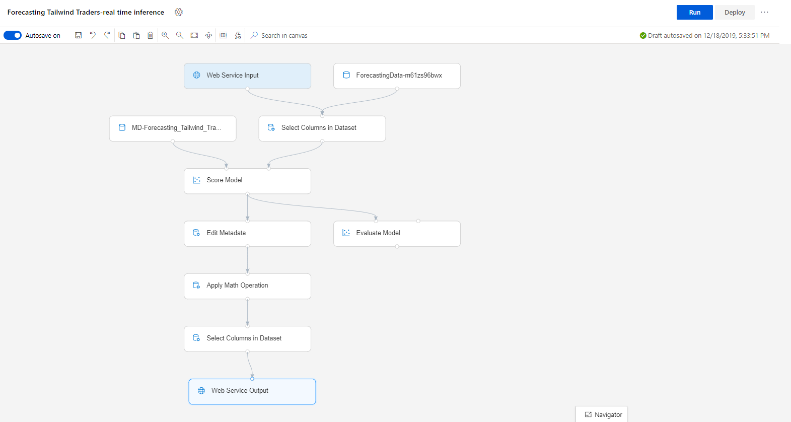

* Click `Deploy`
* Complete deployment details as shown below

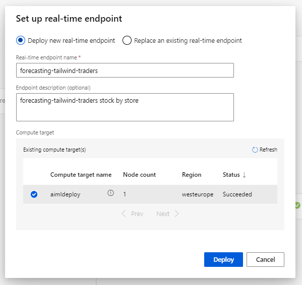

* Navigate to the deployed web service from the left nav.

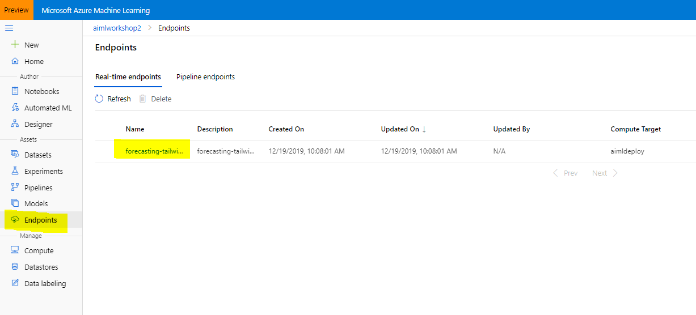

* Click on the name of the web service.
* Review the details of the web service and select Test
* Under the test tab use the default values and click the Test button - you will see only the 4 columns we selected for output
* Click Consume and make a note of your endpoint and key

### 5. Test API with Python in Notebook VMs using Jupyter Notebooks

1. Navigate to Jupyter Lab in your Notebook VM
2. Open the 'ignite-aiml30-get-prediction.ipynb' file
3. Rerun file up until the 'Create function to get prediction from API' cell
4. Update the endpoint URL and the key within the prediction API code cell
7. Run the rest of the code to see your predictions

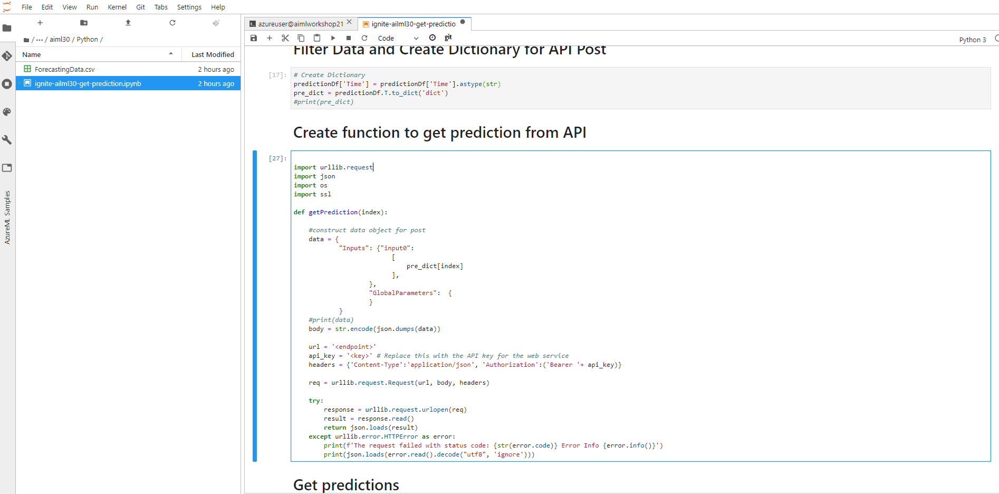

### Congratulations you have built a forecasting model using Azure Machine Learning Designer

Now lets step up the machine learning detail again by diving into the Azure Machine Learning SDK to build, deploy and manage our bespoke open source, code first ML models ...

[Go to Next Lab](../aiml40/workshop-instructions.md)

> If this is the last workshop you are completing, don't forget to delete your resources to save Azure cost. Go to the Azure Portal, select Resource groups and select the resource group name you created for this workshop. Once in the resource group click delete and type the name of the resource group to confirm deletion

## Resources and Continue Learning

Here is a list of related training and documentation.

- [What is the Designer for Azure Machine Learning?](https://docs.microsoft.com/en-us/azure/machine-learning/service/ui-concept-visual-interface?WT.mc_id=msignitethetour-slides-cxa)
- [Publish a Machine Learning Experiment with Microsoft Azure Machine Learning](https://docs.microsoft.com/en-us/learn/paths/publish-experiment-with-ml-studio/)

